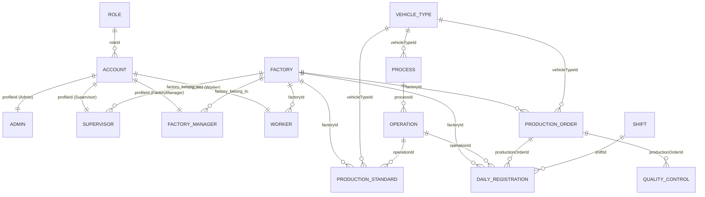

# 📋 NGHIỆP VỤ HỆ THỐNG QUẢN LÝ SẢN XUẤT - AI EBIKE

> **Dự án:** Hệ thống Quản lý Sản xuất Xe điện AI EBIKE (BLUERA)
> **Phiên bản:** 2.2
> **Cập nhật lần cuối:** 11/03/2026
> **Trạng thái:** Đang phát triển

---

## MỤC LỤC

1. [Tổng quan hệ thống](#1-tổng-quan-hệ-thống)
2. [Vai trò & Phân quyền](#2-vai-trò--phân-quyền)
3. [Luồng nghiệp vụ chính](#3-luồng-nghiệp-vụ-chính)
4. [Nghiệp vụ chi tiết](#4-nghiệp-vụ-chi-tiết)
5. [Database Schema (ERD)](#5-database-schema-erd)
6. [Trạng thái dữ liệu](#6-trạng-thái-dữ-liệu)
7. [Cấu trúc dự án](#7-cấu-trúc-dự-án)
8. [Tech Stack & Cấu hình](#8-tech-stack--cấu-hình)

---

## 1. TỔNG QUAN HỆ THỐNG

### 1.1 Mục đích

Hệ thống phục vụ quản lý toàn bộ quy trình sản xuất xe điện, từ thiết lập quy trình lắp ráp đến theo dõi sản lượng, kiểm tra chất lượng (QC), và tính lương thưởng/phạt tự động.

### 1.2 Nguyên tắc cốt lõi

| Nguyên tắc              | Mô tả                                                                                 |
| ----------------------- | ------------------------------------------------------------------------------------- |
| **Phân tách nhà máy**   | Mọi dữ liệu vận hành (lệnh SX, đăng ký, định mức, QC) đều thuộc về một nhà máy cụ thể |
| **Dữ liệu chung**       | Công đoạn & thao tác theo loại xe là dùng chung cho tất cả nhà máy                    |
| **Soft Delete**         | Xóa mềm (active: false) thay vì xóa thật, bảo toàn dữ liệu lịch sử                    |
| **Tài khoản phê duyệt** | Công nhân đăng ký → Admin duyệt → mới được sử dụng hệ thống                           |

---

## 2. VAI TRÒ & PHÂN QUYỀN

### 2.1 Bảng phân quyền tổng hợp

| Chức năng                    |     Admin     |  Supervisor  | FAC_MANAGER  | Worker  |
| ---------------------------- | :-----------: | :----------: | :----------: | :-----: |
| Quản lý loại xe              |      ✅       |      ❌      |      ❌      |   ❌    |
| Quản lý công đoạn & thao tác |      ✅       |      ❌      |      ❌      |   ❌    |
| Quản lý nhà máy              |      ✅       |      ❌      |      ❌      |   ❌    |
| Quản lý tài khoản người dùng |      ✅       |      ❌      |      ✅      |   ❌    |
| Duyệt tài khoản mới đăng ký  |      ✅       |      ❌      |      ❌      |   ❌    |
| Phân công người → nhà máy    |      ✅       |      ❌      |      ❌      |   ❌    |
| Cấu hình định mức sản xuất   |      ❌       |      ❌      |      ✅      |   ❌    |
| Cấu hình thưởng/phạt         |      ❌       |      ❌      |      ✅      |   ❌    |
| Tạo lệnh sản xuất            |      ❌       |      ❌      |      ✅      |   ❌    |
| Quản lý lệnh sản xuất        |  Xem tất cả   | Nhà máy mình | Nhà máy mình |   ❌    |
| Bổ sung công nhân thay thế   |      ❌       |      ✅      |      ✅      |   ❌    |
| Kiểm tra QC                  |      ❌       |      ✅      |      ❌      |   ❌    |
| Đăng ký thao tác (hàng ngày) |      ❌       |      ❌      |      ❌      |   ✅    |
| Nhập sản lượng               |      ❌       |      ❌      |      ❌      |   ✅    |
| Xem lệnh SX nhà máy mình     |      ❌       |      ✅      |      ✅      |   ✅    |
| Xem báo cáo                  | Toàn hệ thống | Nhà máy mình | Nhà máy mình | Cá nhân |

### 2.2 Mô tả vai trò

**Quản trị viên (ADMIN):**
Quản lý cấu trúc hệ thống — loại xe, công đoạn, thao tác, nhà máy, tài khoản. Không tham gia trực tiếp vào sản xuất.

**Giám sát viên (SUPERVISOR):**
Thuộc về một nhà máy. Là người trực tiếp theo dõi tiến độ sản xuất, bổ sung nhân sự, kiểm tra chất lượng. (Không có quyền tạo/sửa lệnh sản xuất và định mức).

**Quản lý nhà máy (FAC_MANAGER):**
Tương tự Supervisor, quản lý hoạt động sản xuất tại nhà máy. ĐẶC BIỆT: Là người duy nhất có quyền tạo/cấu hình định mức và lệnh sản xuất tại nhà máy mình.

**Công nhân (WORKER):**
Thuộc về một nhà máy. Đăng ký thao tác hàng ngày, nhập sản lượng, xem kết quả thưởng/phạt.

---

## 3. LUỒNG NGHIỆP VỤ CHÍNH

### 3.1 Thiết lập hệ thống (một lần)

```
┌─────────────────────────────────────────────────────────────┐
│  ADMIN thiết lập cấu trúc sản xuất (dùng chung)            │
│                                                             │
│  1. Tạo Loại xe (VD: AIE MS1, M1 Sport)                    │
│  2. Tạo Công đoạn cho mỗi loại xe (VD: Hàn khung, Sơn)    │
│  3. Tạo Thao tác cho mỗi công đoạn (VD: Hàn mối A)        │
│  4. Tạo Nhà máy (VD: NM Long Thành, NM Bình Dương)         │
│  5. Phân công Supervisor / Worker → Nhà máy                │
└─────────────────────────────────────────────────────────────┘
```

### 3.2 Thiết lập nhà máy (mỗi nhà máy)

```
┌─────────────────────────────────────────────────────────────┐
│  FAC_MANAGER cấu hình riêng cho nhà máy                     │
│                                                             │
│  1. Cấu hình Định mức cho từng thao tác (phút/cái, SL/ca)  │
│  2. Cấu hình Mức thưởng/phạt theo hiệu suất               │
└─────────────────────────────────────────────────────────────┘
```

### 3.3 Quy trình sản xuất hàng ngày

```
FAC_MANAGER                     WORKER                        HỆ THỐNG
────────                        ──────                        ────────
Tạo lệnh SX ────────────►
(chọn xe, SL, số khung)

Bắt đầu lệnh (▶) ───────►
(pending → in_progress)
                                Đăng ký thao tác ───────►
                                (6:30 - 17:00)
                                                              Tạo bản ghi
                                                              DailyRegistration
                                                              (status: registered)

                                Bắt đầu làm (▶) ────────►
                                                              registered → in_progress
                                                              Ghi checkInTime

                                Nhập sản lượng ─────────►
                                (hoàn thành thao tác)
                                                              in_progress → completed
                                                              Tính thưởng/phạt
                                                              dựa trên định mức

SUPERVISOR
Kiểm tra QC ──────────────►
(đánh pass/fail từng xe)
                                                              Tổng hợp báo cáo
```

---

## 4. NGHIỆP VỤ CHI TIẾT

### 4.1 Số khung & Số động cơ

**Khi tạo lệnh sản xuất**, Supervisor nhập:

- **Prefix số khung:** VD `XDD-A1`
- **Prefix số động cơ:** VD `DC-A1`
- **Số lượng:** VD `100`

**Hệ thống tự sinh:**

```
Số khung:   XDD-A1-001, XDD-A1-002, ..., XDD-A1-100
Số động cơ: DC-A1-001,  DC-A1-002,  ..., DC-A1-100
```

> Supervisor cũng có thể nhập thủ công từng dòng nếu số khung/động cơ không theo quy luật.

**Khi QC:** Chỉ cần nhập số thứ tự (VD: `005`) → hệ thống tự ghép prefix.

**Trong báo cáo:** Hiển thị đầy đủ `XDD-A1-005` / `DC-A1-005`.

### 4.2 Khung giờ đăng ký

| Thời gian       | Quy định                   |
| --------------- | -------------------------- |
| 06:30 → 17:00   | Được phép đăng ký thao tác |
| Ngoài khung giờ | **Từ chối** đăng ký        |

### 4.3 Bổ sung công nhân (Worker Substitution)

Khi công nhân đang làm dở mà **nghỉ đột xuất**:

1. Supervisor chọn bản đăng ký đang dở → đánh dấu `reassigned`
2. Supervisor chọn **công nhân thay thế**
3. Hệ thống tính:

```
SL còn lại = Tổng SL yêu cầu − SL công nhân cũ đã làm
```

4. Công nhân mới chỉ cần hoàn thành **SL còn lại**
5. Báo cáo ghi nhận **cả hai** công nhân

### 4.4 Tính thời gian & Thưởng/Phạt

**Mục tiêu mỗi ngày:** 480 phút (8 tiếng)

**Công thức:**

```
Thời gian thực tế (phút) = Σ (SL thực tế × Định mức phút/cái)
                           cho mỗi thao tác đăng ký trong ngày

Hiệu suất (%) = (Thời gian thực tế / 480) × 100
```

**Ví dụ:**
| Thao tác | Định mức | SL thực tế | Thời gian |
|---|---|---|---|
| Hàn mối A | 5 phút/cái | 80 cái | 400 phút |
| Bắn ốc B | 2 phút/cái | 40 cái | 80 phút |
| **Tổng** | | | **480 phút** ✅ |

**Bảng thưởng/phạt mặc định** (Supervisor có thể điều chỉnh):

| Xếp loại | Hiệu suất | Thưởng/Phạt |
| -------- | --------- | ----------- |
| Xuất sắc | ≥ 110%    | Thưởng 20%  |
| Tốt      | ≥ 100%    | Thưởng 10%  |
| Đạt      | ≥ 95%     | Không       |
| Cảnh báo | ≥ 85%     | Không       |
| Phạt     | < 85%     | Phạt 5%     |

### 4.5 Báo cáo sản xuất

Khi tổng hợp báo cáo theo công đoạn:

| Thông tin           | Mô tả                                |
| ------------------- | ------------------------------------ |
| Số người tham gia   | Bao nhiêu công nhân làm công đoạn đó |
| SL mỗi người        | Mỗi người làm bao nhiêu cái          |
| Thời gian mỗi người | SL × định mức phút                   |
| So sánh             | So với 480 phút mục tiêu             |
| Kết quả             | Đạt / Vượt / Thiếu                   |

### 4.6 Kiểm tra chất lượng (QC)

**Nguyên tắc:**

- Mỗi xe có **1 phiếu QC riêng biệt** (QualityControl document)
- Phiếu chứa danh sách **tất cả thao tác** của loại xe
- Mặc định mọi thao tác = **"pass"** (Đạt)
- Supervisor **chỉ đánh "fail"** khi phát hiện lỗi

**Quy trình:**

1. Supervisor chọn lệnh SX → chọn xe (theo số thứ tự)
2. Hệ thống hiển thị tất cả thao tác của loại xe đó
3. Supervisor đánh `fail` ở thao tác lỗi, nhập ghi chú
4. Thông tin bắt buộc khi đánh lỗi:

| Trường     | Mô tả                    | Ví dụ        |
| ---------- | ------------------------ | ------------ |
| Số khung   | Prefix + số thứ tự       | `XDD-A1-005` |
| Số động cơ | Prefix + số thứ tự       | `DC-A1-005`  |
| Màu xe     | Tùy chọn                 | `Đỏ`         |
| Ngày SX    | Mặc định = ngày hiện tại | `08/03/2026` |

**Kết quả phiếu QC:**

- Nếu tất cả thao tác đều `pass` → Phiếu = `passed`
- Nếu có bất kỳ thao tác `fail` → Phiếu = `failed`

### 4.7 Hệ thống thông báo (Notification)

**Offcanvas panel** (trượt từ phải) khi bấm icon chuông 🔔:

| Loại thông báo          | Điều kiện                                                     | Hiển thị                                                        | Hành động khi bấm                                      |
| ----------------------- | ------------------------------------------------------------- | --------------------------------------------------------------- | ------------------------------------------------------ |
| **Tài khoản chờ duyệt** | Có tài khoản `status = pending`                               | Card vàng, số lượng chờ duyệt                                   | Chuyển đến trang Quản lý TK (`/admin/users?tab=pending`) |
| **Cần bổ sung CN**      | Đăng ký `completed` nhưng `actualQuantity < expectedQuantity` | Nhóm theo lệnh SX → công đoạn, thao tác, tên CN, ngày, số thiếu | Chuyển đến chi tiết lệnh SX (`/admin/production-orders/:id`) |

**Badge đỏ** trên icon chuông = tổng (chờ duyệt + cần bổ sung). Tự động refresh mỗi 30 giây.

**Trạng thái đăng ký công nhân:**

| Điều kiện                                          | Trạng thái       | Label tiếng Việt | Màu           |
| -------------------------------------------------- | ---------------- | ---------------- | ------------- |
| `completed` VÀ `actualQuantity ≥ expectedQuantity` | **completed**    | ✓ Hoàn thành     | 🟢 Xanh       |
| `completed` VÀ `actualQuantity < expectedQuantity` | **completed**    | Cần bổ sung      | 🟠 Cam        |
| `in_progress`                                      | **in_progress**  | ⏱ Đang làm      | 🟡 Vàng       |
| `registered`                                       | **registered**   | 📋 Đã đăng ký   | 🔵 Xanh dương |

**Trạng thái lệnh sản xuất:**

| Status          | Label tiếng Việt | Màu       | Hành động                |
| --------------- | ---------------- | --------- | ------------------------ |
| `pending`       | Chờ bắt đầu     | Xám       | Nút ▶ Bắt đầu, 🗑 Xóa   |
| `in_progress`   | Đang sản xuất    | Xanh dương | Xem chi tiết            |
| `completed`     | Hoàn thành       | Xanh lá   | Xem chi tiết             |
| `paused`        | Tạm dừng         | Vàng      | —                        |
| `cancelled`     | Đã hủy           | Đỏ        | —                        |

### 4.8 Luồng đăng ký của công nhân

**3 bước:**

1. **Đăng ký** → status `registered`, hiện nút **"Bắt đầu"** (xanh lá) + **"Hủy đăng ký"**
2. **Bắt đầu** → status `in_progress`, ghi `checkInTime`, hiện nút **"Nhập kết quả"** (xanh dương)
3. **Hoàn thành** → status `completed`, ghi `checkOutTime`, tính thưởng/phạt, hiện badge SL đã làm

> **Auto-start:** Nếu công nhân vào trang nhập kết quả mà chưa bắt đầu (status = registered), hệ thống tự động chuyển sang `in_progress` trước khi hiện form.

> **Validation:** Không cho phép nhập kết quả nếu đã `completed` hoặc `reassigned`.

### 4.9 Bổ sung công nhân

Khi bấm nút **"+ Bổ sung"** ở mỗi dòng ngày trong chi tiết thao tác:

1. **Thao tác**: Tự động điền, **không cho đổi** (disabled)
2. **Số lượng**: Tự tính = `SL lệnh - Tổng đã làm` (còn lại)
3. **Công nhân**: Chọn từ danh sách
4. Không yêu cầu nhập lý do

**Chi tiết lệnh SX** (popup 👁):

- Công đoạn → đóng/mở
- Thao tác → đóng/mở, tổng lượt/SP
- Nhóm theo ngày, mỗi ngày có nút **"+ Bổ sung"** riêng

---

## 5. DATABASE SCHEMA (ERD)

### 5.1 Sơ đồ quan hệ tổng thể



### 5.2 Chi tiết từng Collection

---

#### 🔐 `roles` — Vai trò

| Trường        | Kiểu                       | Bắt buộc | Mô tả                                                      |
| ------------- | -------------------------- | :------: | ---------------------------------------------------------- |
| `name`        | String                     |    ✅    | Tên vai trò (VD: "Quản trị viên")                          |
| `code`        | String (unique, uppercase) |    ✅    | Mã vai trò: `ADMIN`, `SUPERVISOR`, `WORKER`, `FAC_MANAGER` |
| `description` | String                     |          | Mô tả                                                      |

---

#### 🔑 `accounts` — Tài khoản đăng nhập

| Trường         | Kiểu               | Bắt buộc | Mô tả                                                            |
| -------------- | ------------------ | :------: | ---------------------------------------------------------------- |
| `code`         | String (unique)    |    ✅    | Mã nhân viên (VD: "AD001", "CN001")                              |
| `email`        | String             |          | Email                                                            |
| `password`     | String (hashed)    |    ✅    | Mật khẩu (bcrypt, min 6 ký tự)                                   |
| `roleId`       | ObjectId → Role    |    ✅    | Vai trò của tài khoản                                            |
| `profileId`    | ObjectId (dynamic) |    ✅    | ID profile tương ứng (polymorphic)                               |
| `profileModel` | String enum        |    ✅    | Model name: `Admin` / `Supervisor` / `Worker` / `FactoryManager` |
| `active`       | Boolean            |          | Kích hoạt (default: true)                                        |
| `status`       | String enum        |          | `pending` / `approved` / `rejected`                              |

> **Polymorphic Reference:** `profileId` trỏ đến 1 trong 4 collection khác nhau tùy theo `profileModel`.

---

#### 👔 `admins` — Hồ sơ Admin

| Trường        | Kiểu               | Bắt buộc | Mô tả              |
| ------------- | ------------------ | :------: | ------------------ |
| `accountId`   | ObjectId → Account |    ✅    | Liên kết tài khoản |
| `name`        | String             |    ✅    | Họ tên             |
| `dateOfBirth` | Date               |          | Ngày sinh          |
| `citizenId`   | String             |          | CCCD/CMND          |
| `address`     | String             |          | Địa chỉ            |

---

#### 🔍 `supervisors` — Hồ sơ Giám sát

| Trường              | Kiểu               | Bắt buộc | Mô tả                 |
| ------------------- | ------------------ | :------: | --------------------- |
| `accountId`         | ObjectId → Account |    ✅    | Liên kết tài khoản    |
| `name`              | String             |    ✅    | Họ tên                |
| `dateOfBirth`       | Date               |          | Ngày sinh             |
| `citizenId`         | String             |          | CCCD/CMND             |
| `address`           | String             |          | Địa chỉ               |
| `factory_belong_to` | ObjectId → Factory |          | **Nhà máy phụ trách** |

---

#### 🏭 `factorymanagers` — Hồ sơ Quản lý NM

| Trường              | Kiểu               | Bắt buộc | Mô tả                 |
| ------------------- | ------------------ | :------: | --------------------- |
| `accountId`         | ObjectId → Account |    ✅    | Liên kết tài khoản    |
| `name`              | String             |    ✅    | Họ tên                |
| `dateOfBirth`       | Date               |          | Ngày sinh             |
| `citizenId`         | String             |          | CCCD/CMND             |
| `address`           | String             |          | Địa chỉ               |
| `factory_belong_to` | ObjectId → Factory |          | **Nhà máy phụ trách** |

---

#### 👷 `workers` — Hồ sơ Công nhân

| Trường        | Kiểu               | Bắt buộc | Mô tả                |
| ------------- | ------------------ | :------: | -------------------- |
| `accountId`   | ObjectId → Account |    ✅    | Liên kết tài khoản   |
| `name`        | String             |    ✅    | Họ tên               |
| `dateOfBirth` | Date               |          | Ngày sinh            |
| `citizenId`   | String             |          | CCCD/CMND            |
| `address`     | String             |          | Địa chỉ              |
| `factoryId`   | ObjectId → Factory |          | **Nhà máy làm việc** |

---

#### 🏭 `factories` — Nhà máy

| Trường     | Kiểu            | Bắt buộc | Mô tả                     |
| ---------- | --------------- | :------: | ------------------------- |
| `name`     | String          |    ✅    | Tên nhà máy               |
| `code`     | String (unique) |    ✅    | Mã nhà máy (VD: "NM-LT")  |
| `location` | String          |          | Địa chỉ                   |
| `active`   | Boolean         |          | Hoạt động (default: true) |

---

#### 🚗 `vehicletypes` — Loại xe

| Trường        | Kiểu            | Bắt buộc | Mô tả                       |
| ------------- | --------------- | :------: | --------------------------- |
| `name`        | String          |    ✅    | Tên loại xe (VD: "AIE MS1") |
| `code`        | String (unique) |    ✅    | Mã loại xe (VD: "AIEMS1")   |
| `description` | String          |          | Mô tả                       |
| `active`      | Boolean         |          | Soft delete (default: true) |

**Virtual:** `processes` → populate danh sách công đoạn

---

#### ⚙️ `processes` — Công đoạn

| Trường          | Kiểu                   | Bắt buộc | Mô tả                            |
| --------------- | ---------------------- | :------: | -------------------------------- |
| `vehicleTypeId` | ObjectId → VehicleType |    ✅    | Thuộc loại xe nào                |
| `name`          | String                 |    ✅    | Tên công đoạn (VD: "Lắp khung")  |
| `code`          | String (unique)        |    ✅    | Mã công đoạn (VD: "AIEMS1-CD01") |
| `order`         | Number                 |          | Thứ tự hiển thị                  |
| `description`   | String                 |          | Mô tả                            |
| `active`        | Boolean                |          | Soft delete                      |

**Virtual:** `operations` → populate danh sách thao tác
**Index:** `{ vehicleTypeId, order }`

---

#### 🔧 `operations` — Thao tác

| Trường                   | Kiểu               | Bắt buộc | Mô tả                             |
| ------------------------ | ------------------ | :------: | --------------------------------- |
| `processId`              | ObjectId → Process |    ✅    | Thuộc công đoạn nào               |
| `name`                   | String             |    ✅    | Tên thao tác                      |
| `code`                   | String (unique)    |    ✅    | Mã thao tác (VD: "AIEMS1-TT01")   |
| `difficulty`             | Number (1-5)       |          | Độ khó                            |
| `allowTeamwork`          | Boolean            |          | Cho phép nhiều người cùng làm     |
| `maxWorkers`             | Number (1-10)      |          | Số CN tối đa                      |
| `standardQuantity`       | Number             |          | SL chuẩn/ca                       |
| `standardMinutes`        | Number             |          | Phút chuẩn để hoàn thành SL chuẩn |
| `standardTime`           | Number             |          | Phút/sản phẩm                     |
| `workingMinutesPerShift` | Number             |          | Phút làm việc/ca (default: 480)   |
| `instructions`           | String             |          | Hướng dẫn                         |
| `description`            | String             |          | Mô tả chất lượng                  |
| `active`                 | Boolean            |          | Soft delete                       |

---

#### 📏 `productionstandards` — Định mức sản xuất

> ⚠️ **Scoped theo nhà máy** — mỗi nhà máy có định mức riêng cho mỗi thao tác

| Trường             | Kiểu                   | Bắt buộc | Mô tả                   |
| ------------------ | ---------------------- | :------: | ----------------------- |
| `vehicleTypeId`    | ObjectId → VehicleType |    ✅    | Loại xe                 |
| `operationId`      | ObjectId → Operation   |    ✅    | Thao tác                |
| `factoryId`        | ObjectId → Factory     |    ✅    | **Nhà máy**             |
| `expectedQuantity` | Number                 |    ✅    | SL quy định (min: 1)    |
| `bonusPerUnit`     | Number                 |          | Tiền thưởng/đơn vị vượt |
| `penaltyPerUnit`   | Number                 |          | Tiền phạt/đơn vị thiếu  |
| `description`      | String                 |          | Mô tả                   |

**Unique Index:** `{ factoryId, vehicleTypeId, operationId }`

---

#### 📋 `productionorders` — Lệnh sản xuất

| Trường             | Kiểu                   | Bắt buộc | Mô tả                                                 |
| ------------------ | ---------------------- | :------: | ----------------------------------------------------- |
| `orderCode`        | String (unique)        |    ✅    | Mã lệnh (VD: "LSX-2026-001")                          |
| `vehicleTypeId`    | ObjectId → VehicleType |    ✅    | Loại xe                                               |
| `factoryId`        | ObjectId → Factory     |    ✅    | **Nhà máy**                                           |
| `quantity`         | Number                 |    ✅    | Số lượng xe (min: 1)                                  |
| `frameNumbers`     | [String]               |          | Danh sách số khung                                    |
| `engineNumbers`    | [String]               |          | Danh sách số động cơ                                  |
| `startDate`        | Date                   |    ✅    | Ngày bắt đầu                                          |
| `expectedEndDate`  | Date                   |          | Ngày dự kiến hoàn thành                               |
| `actualEndDate`    | Date                   |          | Ngày hoàn thành thực tế                               |
| `status`           | String enum            |          | `pending` / `in_progress` / `completed` / `cancelled` |
| `createdBy`        | ObjectId → User        |    ✅    | Người tạo                                             |
| `note`             | String                 |          | Ghi chú                                               |
| `processProgress`  | [subdoc]               |          | Tiến độ từng công đoạn                                |
| `completionChecks` | [subdoc]               |          | Lịch sử kiểm tra hoàn thành                           |

**processProgress subdoc:**
| Trường | Kiểu | Mô tả |
|---|---|---|
| `processId` | ObjectId → Process | Công đoạn |
| `processName` | String | Tên (cache) |
| `requiredQuantity` | Number | SL cần |
| `completedQuantity` | Number | SL đã hoàn thành |
| `status` | String enum | `pending` / `in_progress` / `completed` |

---

#### 📝 `dailyregistrations` — Đăng ký công việc

| Trường                | Kiểu                 | Bắt buộc | Mô tả                                                     |
| --------------------- | -------------------- | :------: | --------------------------------------------------------- |
| `userId`              | ObjectId → User      |    ✅    | Công nhân                                                 |
| `shiftId`             | ObjectId → Shift     |    ✅    | Ca làm việc                                               |
| `date`                | Date                 |    ✅    | Ngày                                                      |
| `productionOrderId`   | ObjectId → PO        |    ✅    | Lệnh SX                                                   |
| `operationId`         | ObjectId → Operation |    ✅    | Thao tác                                                  |
| `factoryId`           | ObjectId → Factory   |    ✅    | **Nhà máy**                                               |
| `registeredAt`        | Date                 |          | Thời điểm đăng ký                                         |
| `status`              | String enum          |          | `registered` / `in_progress` / `completed` / `reassigned` |
| `actualQuantity`      | Number               |          | SL thực tế                                                |
| `expectedQuantity`    | Number               |    ✅    | SL kỳ vọng (từ định mức)                                  |
| `deviation`           | Number               |          | Chênh lệch (actual - expected)                            |
| `interruptionNote`    | String               |          | Lý do gián đoạn                                           |
| `interruptionMinutes` | Number               |          | Phút gián đoạn                                            |
| `bonusAmount`         | Number               |          | Tiền thưởng                                               |
| `penaltyAmount`       | Number               |          | Tiền phạt                                                 |
| `adjustedBy`          | ObjectId → User      |          | Người điều chỉnh                                          |
| `adjustedExpectedQty` | Number               |          | SL kỳ vọng sau điều chỉnh                                 |
| `adjustmentNote`      | String               |          | Ghi chú điều chỉnh                                        |
| `workingMinutes`      | Number               |          | Phút làm việc thực tế                                     |
| `checkInTime`         | Date                 |          | Giờ vào                                                   |
| `checkOutTime`        | Date                 |          | Giờ ra                                                    |
| `isReplacement`       | Boolean              |          | Là CN bổ sung?                                            |
| `reassignedFrom`      | ObjectId → User      |          | Thay cho CN nào                                           |
| `replacementReason`   | String               |          | Lý do thay thế                                            |
| `earlyLeaveReason`    | String               |          | Lý do về sớm                                              |

**Indexes:**

- `{ userId, date }` — lấy đăng ký theo CN + ngày
- `{ productionOrderId }` — lấy theo lệnh SX
- `{ operationId, date }` — thống kê theo thao tác

---

#### ⏰ `shifts` — Ca làm việc

| Trường                | Kiểu            | Bắt buộc | Mô tả                                |
| --------------------- | --------------- | :------: | ------------------------------------ |
| `userId`              | ObjectId → User |    ✅    | Công nhân                            |
| `date`                | Date            |    ✅    | Ngày                                 |
| `startTime`           | Date            |    ✅    | Giờ bắt đầu                          |
| `endTime`             | Date            |          | Giờ kết thúc (null = chưa KT)        |
| `totalWorkingMinutes` | Number          |          | Tổng phút làm việc                   |
| `status`              | String enum     |          | `active` / `completed` / `cancelled` |

**Index:** `{ userId, date }`

---

#### ✅ `qualitycontrols` — Kiểm tra chất lượng (QC)

> Mỗi document = 1 phiếu QC cho **1 xe**

| Trường              | Kiểu            | Bắt buộc | Mô tả                        |
| ------------------- | --------------- | :------: | ---------------------------- |
| `productionOrderId` | ObjectId → PO   |    ✅    | Lệnh sản xuất                |
| `frameNumber`       | String          |    ✅    | Số khung xe                  |
| `engineNumber`      | String          |    ✅    | Số động cơ                   |
| `color`             | String          |          | Màu xe                       |
| `inspectionDate`    | Date            |          | Ngày kiểm tra (default: now) |
| `inspectorId`       | ObjectId → User |    ✅    | Người kiểm tra               |
| `results`           | [subdoc]        |          | Kết quả từng thao tác        |
| `status`            | String enum     |          | `passed` / `failed`          |

**results subdoc:**
| Trường | Kiểu | Mô tả |
|---|---|---|
| `operationId` | ObjectId → Operation | Thao tác |
| `status` | String enum | `pass` / `fail` |
| `note` | String | Ghi chú lỗi |

**Indexes:**

- `{ frameNumber, engineNumber }` — tra cứu nhanh theo số khung/máy
- `{ productionOrderId }` — lấy tất cả QC theo lệnh

---

#### ⚙️ `settings` — Cấu hình hệ thống

| Trường        | Kiểu            | Bắt buộc | Mô tả                 |
| ------------- | --------------- | :------: | --------------------- |
| `key`         | String (unique) |    ✅    | Khóa cấu hình         |
| `value`       | Mixed           |    ✅    | Giá trị (bất kỳ kiểu) |
| `description` | String          |          | Mô tả                 |
| `updatedBy`   | ObjectId → User |          | Người cập nhật        |

---

## 6. TRẠNG THÁI DỮ LIỆU

### 6.1 Lệnh sản xuất (ProductionOrder)

```
[pending] ──▶ (Nút Bắt đầu ▶) ──▶ [in_progress] ──► [completed]
    │             │                  (Đang SX)
    │             Label: "Chờ bắt đầu"              Label: "Hoàn thành"
    └──► [cancelled]
```

### 6.2 Đăng ký công việc (DailyRegistration)

```
[registered] ──▶ (Nút Bắt đầu) ──▶ [in_progress] ──▶ (Nhập kết quả) ──▶ [completed]
  📋 Đã đăng ký      ghi checkInTime    ⏱ Đang làm       ghi checkOutTime     ✓ Hoàn thành
                                              │                                  tính thưởng/phạt
                                              └──► [reassigned] (chuyển cho CN khác)
```

### 6.3 Tài khoản (Account)

```
[pending] ──► [approved] (Admin duyệt)
    │
    └──► [rejected] (Admin từ chối)
```

> **Lưu ý:** Admin có quyền duyệt tất cả. FAC_MANAGER có quyền tạo/sửa/xóa Worker và Supervisor thuộc nhà máy mình quản lý nhưng không có quyền duyệt (approve) tài khoản tự đăng ký.

### 6.4 Ca làm việc (Shift)

```
[active] ──► [completed]
    │
    └──► [cancelled]
```

---

## 7. CẤU TRÚC DỰ ÁN

```
quanlycongnhan/
│
├── backend/                          # API Server (Node.js + Express + TS)
│   └── src/
│       ├── config/                   # Database, environment
│       │   ├── db.ts                 # MongoDB connection
│       │   └── env.ts                # Environment variables
│       ├── middlewares/              # Global middleware
│       │   └── auth.ts               # JWT authentication
│       ├── modules/                  # Feature modules
│       │   ├── auth/                 # Login, Register, Password
│       │   │   ├── account.model.ts
│       │   │   ├── auth.controller.ts
│       │   │   └── auth.routes.ts
│       │   ├── roles/                # Role model
│       │   ├── factories/            # Factory CRUD
│       │   ├── admins/               # Admin profile
│       │   ├── supervisors/          # Supervisor profile
│       │   ├── facManagers/          # Factory Manager profile
│       │   ├── workers/              # Worker profile
│       │   ├── vehicleTypes/         # Vehicle type CRUD
│       │   ├── processes/            # Process CRUD + service
│       │   ├── operations/           # Operation CRUD
│       │   ├── productionStandards/  # Per-factory standards
│       │   ├── productionOrders/     # Production order lifecycle
│       │   ├── registrations/        # Daily work registration
│       │   ├── shifts/               # Shift management
│       │   ├── qc/                   # Quality control inspection
│       │   ├── reports/              # Reporting & analytics
│       │   ├── settings/             # System configuration
│       │   └── worklogs/             # Work log history
│       ├── services/                 # External services (email, etc.)
│       ├── scripts/                  # DB seed & migration scripts
│       ├── types/                    # TypeScript interfaces
│       ├── utils/                    # Helper functions
│       └── app.ts                    # Express entry point
│
├── frontend/                         # Web Client (React + Vite + TS)
│   └── src/
│       ├── components/               # Reusable UI
│       │   ├── layouts/              # AdminLayout, WorkerLayout
│       │   └── ui/                   # shadcn/ui components
│       ├── contexts/                 # React contexts
│       │   └── AuthContext.tsx        # Authentication state
│       ├── pages/                    # Page components
│       │   ├── admin/                # Admin pages (Dashboard, Orders, Users...)
│       │   ├── supervisor/           # Supervisor pages (QC...)
│       │   ├── worker/               # Worker pages (Register, Submit...)
│       │   ├── auth/                 # Login, Register
│       │   └── shared/               # Shared pages (Account)
│       ├── services/                 # API layer
│       │   └── api.ts                # Centralized API calls
│       ├── types/                    # TypeScript types
│       └── App.tsx                   # Routes & role-based guards
│
├── BUSINESS_REQUIREMENTS.md          # (File này)
├── README.md                         # Quick start guide
└── docker-compose.yml               # Docker deployment
```

---

## 8. TECH STACK & CẤU HÌNH

### 8.1 Công nghệ

| Layer      | Technology                     | Version          |
| ---------- | ------------------------------ | ---------------- |
| Frontend   | React + Vite + TypeScript      | React 19, Vite 6 |
| UI Library | shadcn/ui + TailwindCSS        | Latest           |
| Backend    | Node.js + Express + TypeScript | Node 18+         |
| Runtime    | tsx (dev), PM2 (prod)          |                  |
| Database   | MongoDB Atlas + Mongoose       |                  |
| Auth       | JWT + Cookie-based             |                  |
| Deploy     | PM2 / Docker Compose           |                  |

### 8.2 Hiệu năng & Tối ưu

Tất cả các trang quản trị (Loại xe, Lệnh sản xuất, Định mức sản xuất, Quản lý người dùng, Lịch sử làm việc) đều được áp dụng **Phân trang phía Server (Server-side Pagination)** với các quy tắc:

- **Số lượng hiển thị:** Mặc định 10 bản ghi/trang.
- **Thống kê tổng:** Các con số thống kê (Tổng số user, sản lượng tổng...) luôn tính trên toàn bộ dữ liệu (không bị ảnh hưởng bởi phân trang).
- **Tìm kiếm & Bộ lọc:** Kết hợp trực tiếp với phân trang để đảm bảo tốc độ tải và trải nghiệm mượt mà.

### 8.3 Test Accounts

| Vai trò     | Mã    | Mật khẩu | Nhà máy           |
| ----------- | ----- | -------- | ----------------- |
| Admin       | AD001 | 123456   | — (toàn hệ thống) |
| Supervisor  | GS001 | 123456   | Theo phân công    |
| FAC Manager | QL001 | 123456   | Theo phân công    |
| Worker      | CN001 | 123456   | Theo phân công    |

### 8.4 API URLs

| Môi trường | Backend                         | Frontend                    |
| ---------- | ------------------------------- | --------------------------- |
| Local Dev  | http://localhost:5000           | http://localhost:5173       |
| Production | https://qlsx-api.bluerabike.com | https://qlsx.bluerabike.com |

---

> **Lưu ý:** Tài liệu này là nguồn chính thức cho toàn bộ nghiệp vụ dự án. Mọi thay đổi nghiệp vụ phải được cập nhật tại đây trước khi triển khai code. Khi có developer mới tham gia, đọc file này trước tiên.
